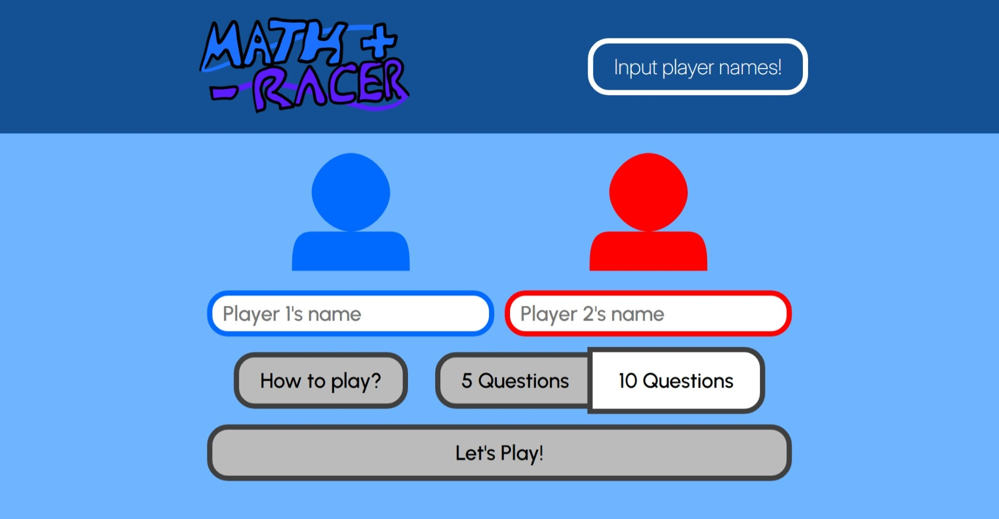
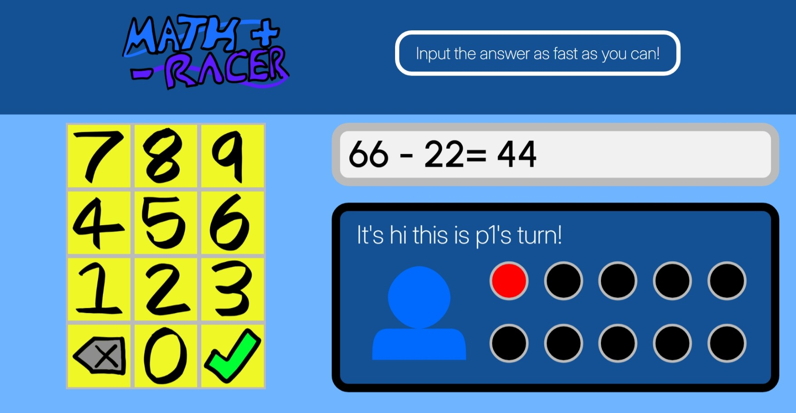
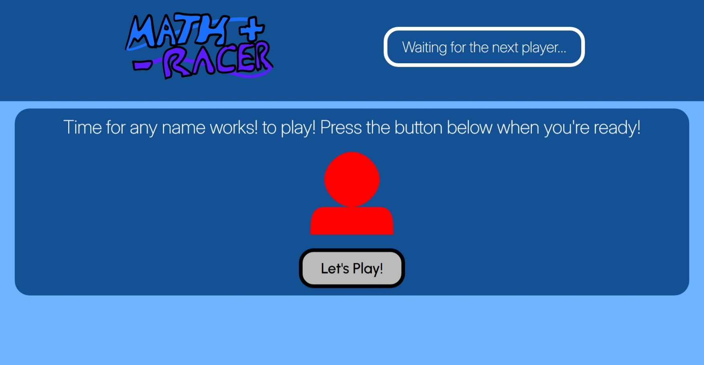
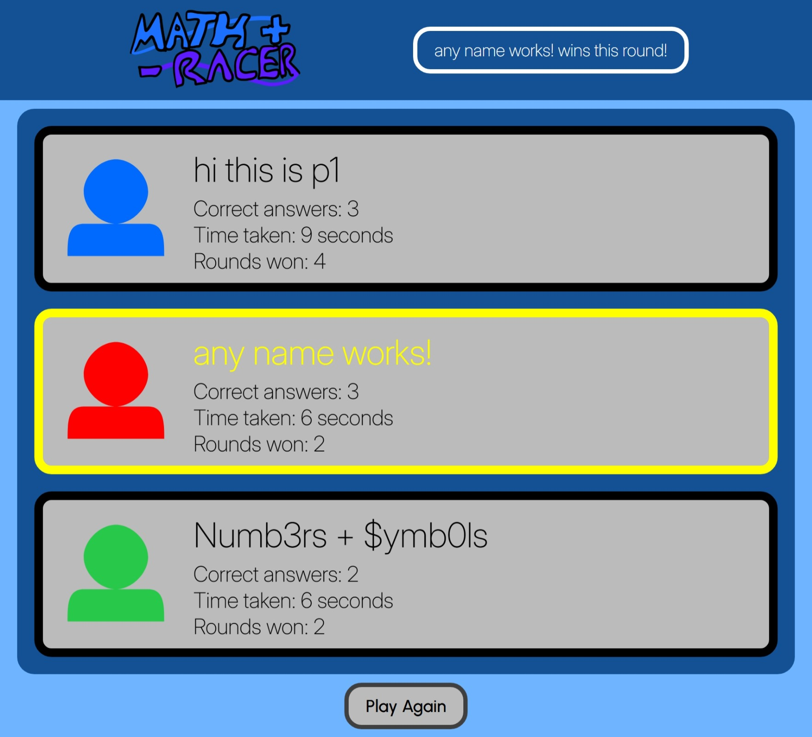
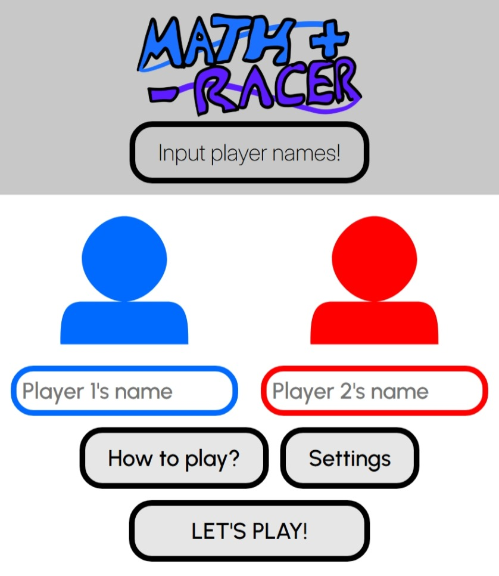

# template-repo
Inspired by [TypeRacer](https://play.typeracer.com/), MathRacer is a fast-paced game where two players compete to complete 10 simple maths questions in the shortest time possible!

Live demo link: https://j0e-quan.github.io/mathracer/

## Technologies used:
 - HTML for basic page layout
 - CSS for styling elements and use of web fonts (Inter for headings, Urbanist for body text)
 - Flexbox and Grid for arranging elements and making the website somewhat responsive
 - JavaScript for game logic and dynamically creating elements/UI
 - Git for version control

## Key features:
 - Players can input their own names
 - Tutorial menu helps to familiarize players with the game
 - Large-sized UI improves visibility
 - The game also features keyboard support

## Credits: 
 - Logo and numpad icons were drawn by me using Adobe Fresco
 - Player icons were made by me using [Yann Armelin's SVG path editor](https://yqnn.github.io/svg-path-editor/)

## Gallery:

