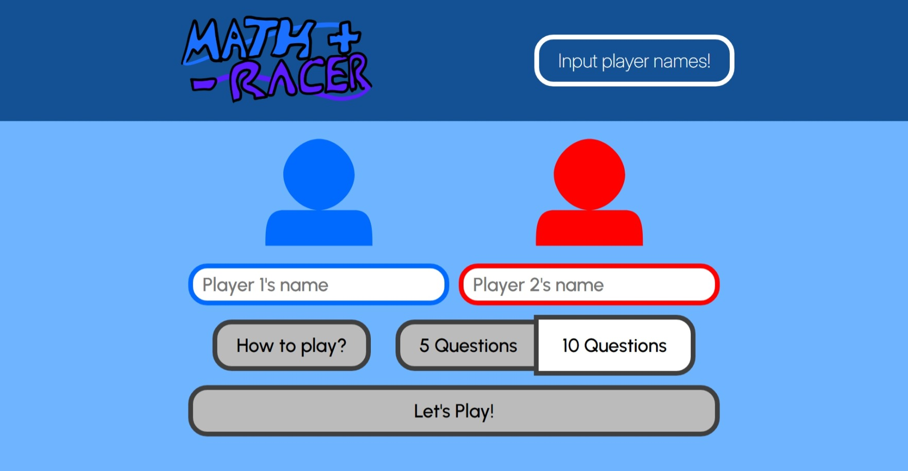
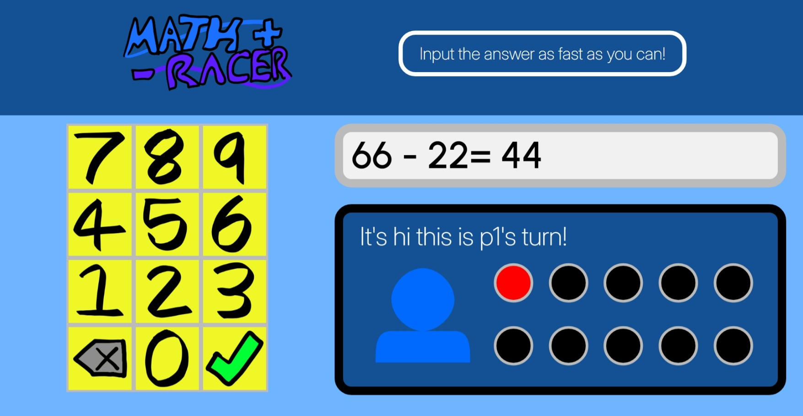
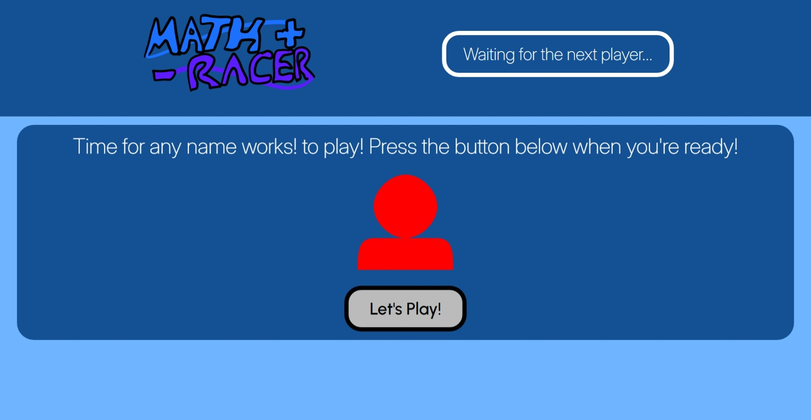
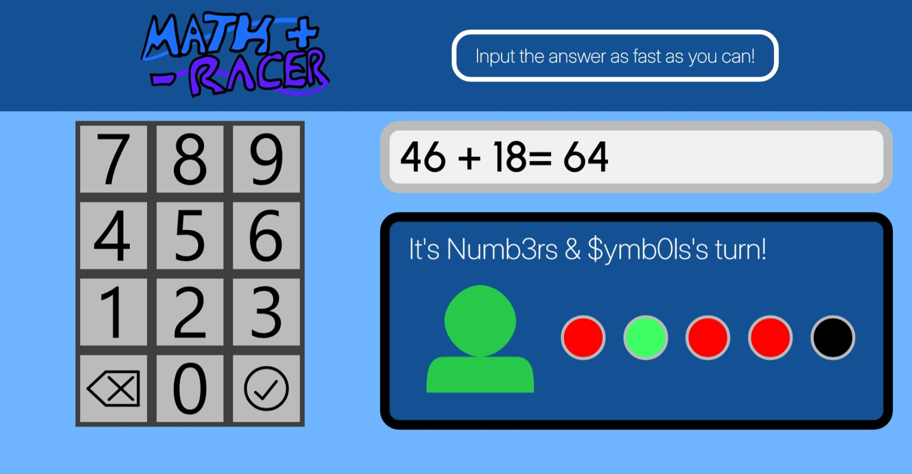
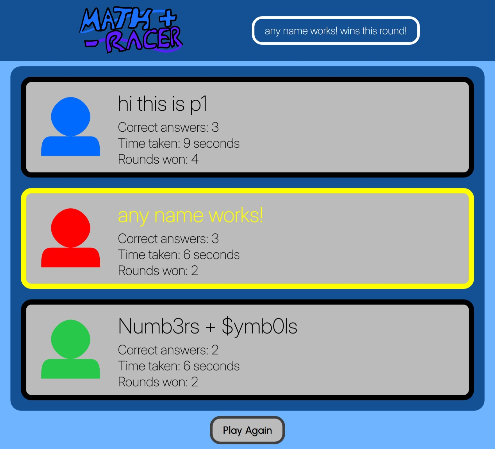

# MathRacer

Inspired by [TypeRacer](https://play.typeracer.com/), MathRacer is a fast-paced game where two players compete to answer several simple maths questions in the shortest time possible!

Live demo link: https://j0e-quan.github.io/mathracer/

## Technologies used:

- HTML for basic page layout
- CSS for styling elements and use of web fonts (Inter for headings, Urbanist for body text)
- Flexbox and Grid for arranging elements
- JavaScript for game logic and dynamically creating elements/UI
- npm and webpack for managing and bundling code modules
- Git for version control

## Key features:

- Players can input their own names and adjust the number of questions per round
- Tutorial menu helps to familiarize players with the game
- Large-sized UI improves visibility
- The game features keyboard support

## Credits:

- Logo and numpad icons were drawn by me using Adobe Fresco
- Player icons were made by me using [Yann Armelin's SVG path editor](https://yqnn.github.io/svg-path-editor/)

## Gallery:

## Getting started:

1. clone this repo in your desired folder: `git clone https://github.com/J0e-Quan/mathracer.git`
2. `npm install` to install any required dependencies
3. `npm run dev` to activate the dev server (View the project by navigating to the localhost address shown in your terminal.)
4. `npm run build` will bundle the code into the 'dist' folder
